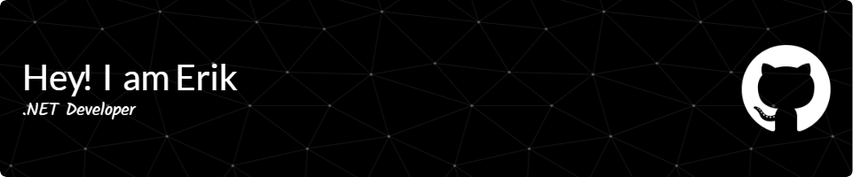

<h3 align="left">I am a .Net developer from Armenia.</h3>

- 👨‍💻 Explore all of my projects on [GitHub](https://github.com/Erik-Egnatosyan?tab=repositories)

- 📄 Know about my experiences [CV](https://drive.google.com/file/d/1mB6xRGstMxrFtiUCnoJvPiY-JwvuOTPf/view?usp=sharing)</a>

- 🔭 Currently contributing as a Software Engineer at [Globbing](https://am.globbing.com/en)

- 👀 Check out my project [Codenyx](https://www.codenyx.am/)

- 📫 How to reach me **erikegnatosyan@gmail.com**

- 🌱  Actively expanding my knowledge in **ASP .NET MVC** and **AvaloniaUI**

- 💬 Feel free to ask me about **C#, HTML, CSS**
---
<h1 align="left">🧰Languages and Tools:</h1>

           

---
<h1 align="left">📊Statistics:</h1>

    

---
<h1>Codenyx page status⚙🌐</h1>

<h1 align="left">Connect with me:</h1>

 
