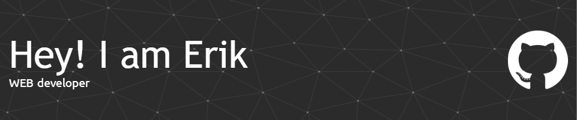

<h3 align="left">I am a frontend developer from Armenia.</h3>

- 👨‍💻 All of my projects are available at [https://github.com/Erik-Egnatosyan?tab=repositories](https://github.com/Erik-Egnatosyan?tab=repositories)

- 📄 Know about my experiences https://files.catbox.moe/qz12ny.pdf

- 🔭 I’m currently working on [Codenyx](https://www.codenyx.am/)

- 📫 How to reach me **sans.egnatosyan@gmail.com**

- 🌱 I’m currently learning **C#**

- 💬 Ask me about **HTML,CSS,JS,C#**
---
<h1 align="left">🧰Languages and Tools:</h1>

              </a> <a href="https://codepen.io/SansaciaCodenyx" target="_blank" rel="noreferrer"> 

---
<h1 align="left">📊Statistics:</h1>

    

---
<h1>Codenyx page status⚙🌐</h1>

<h1 align="left">Connect with me:</h1>

 
